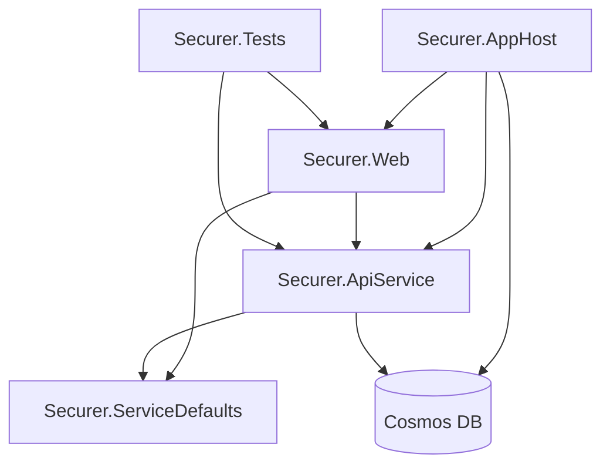
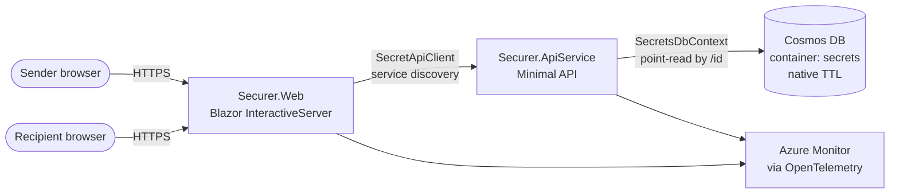
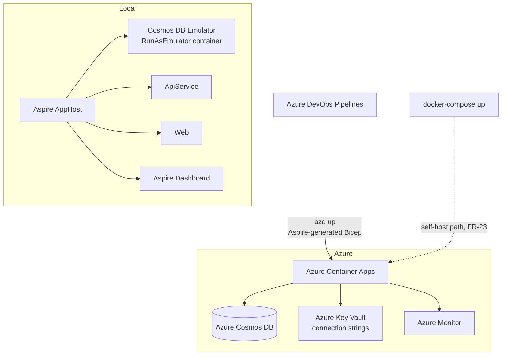
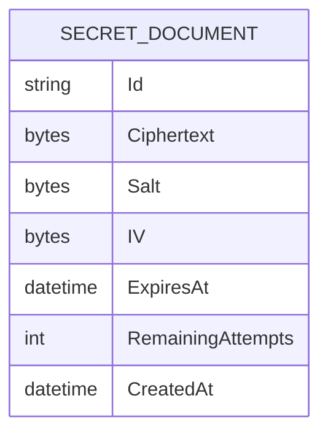
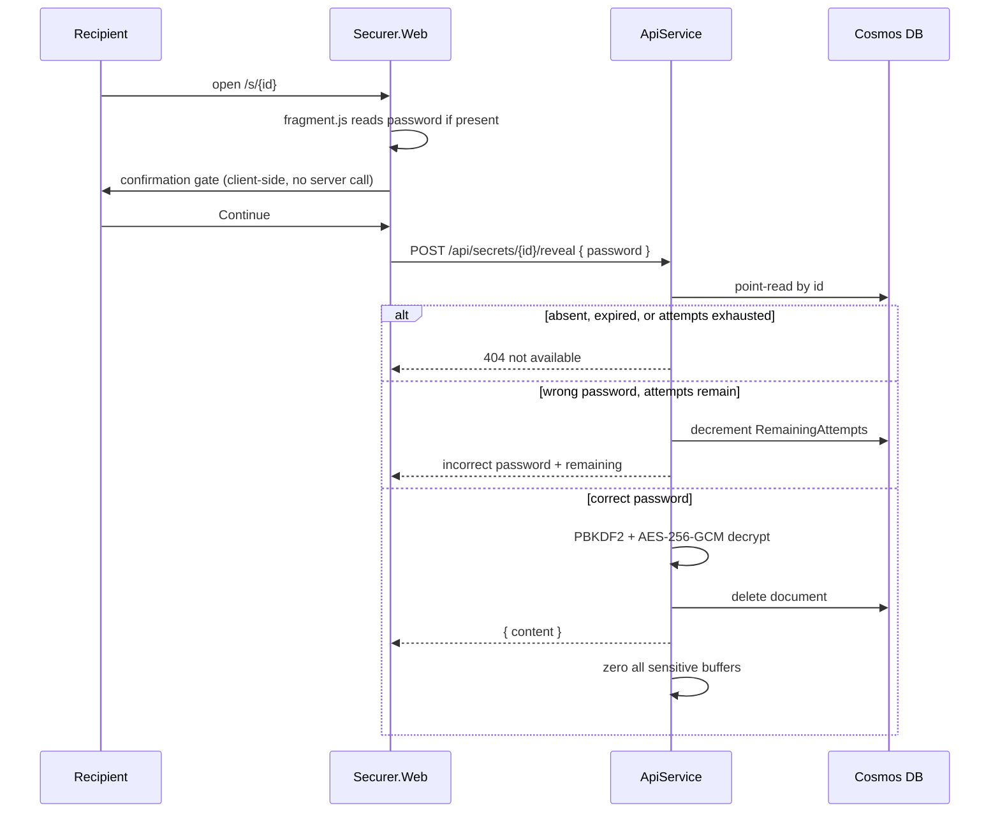

# Architecture Spine — Securer

## Design Paradigm

**Layered service architecture** with one deliberately unusual operation at its centre: a destructive read.

Layers map to projects, and the dependency direction is one-way:

| Layer | Project | Owns |
|---|---|---|
| Orchestration | `Securer.AppHost` | Service wiring, local Cosmos emulator, resource references |
| Shared configuration | `Securer.ServiceDefaults` | Telemetry, health checks, resilience |
| Presentation | `Securer.Web` | Blazor pages, components, API client, JS interop |
| Application + domain | `Securer.ApiService` | Endpoints, `SecretService`, `CryptoService`, middleware |
| Persistence | `Securer.ApiService/Data` | `SecretsDbContext` over Cosmos DB |

The paradigm choice is driven by one property the product cannot compromise: **a Reveal must deliver the Secret and destroy the record, or do neither.** Everything else in this spine is ordinary layering; that single operation is why the layering is strict about where crypto and persistence may be touched.

## Invariants & Rules

### AD-1 — Encryption is server-side only, keyed by the sender's password `[ADOPTED]`

- **Binds:** FR-17, FR-18, FR-19, FR-20, NFR-9
- **Prevents:** A client-side crypto path appearing alongside the server one, giving two key-derivation implementations that must agree forever; or a server-held key that quietly makes the zero-knowledge claim false.
- **Rule:** The Secret is encrypted and decrypted only inside `Securer.ApiService`, only with the sender-supplied Password. No key material is stored, derived from a server secret, or escrowed anywhere. The frontend never encrypts, decrypts, or derives keys.

### AD-2 — Cryptography comes from `System.Security.Cryptography` only

- **Binds:** FR-17, FR-19
- **Prevents:** A bespoke scheme, a third-party crypto package, or a hand-rolled construction that has to be security-reviewed by every future reader.
- **Rule:** AES-256-GCM for authenticated encryption; PBKDF2 via `Rfc2898DeriveBytes` for key derivation from Password plus a per-Secret random salt. No external crypto dependency may be added. Composing these primitives differently — a different mode, a different KDF — is a spine change, not an implementation choice.

### AD-3 — Sensitive buffers are zeroed, never garbage

- **Binds:** FR-20, NFR-9
- **Prevents:** Plaintext and Passwords lingering in managed strings that cannot be cleared, surviving in memory long past the request that needed them.
- **Rule:** Sensitive data moves as `Span<byte>` and is cleared with `CryptographicOperations.ZeroMemory()` after use, on success and failure paths alike. `string` is avoided for Passwords and plaintext wherever the API allows.

### AD-4 — Password verification is constant-time

- **Binds:** FR-8, NFR-10
- **Prevents:** A timing side channel that distinguishes a wrong Password from a missing Secret, reintroducing the oracle FR-22 removes.
- **Rule:** All comparison of Password-derived material uses `CryptographicOperations.FixedTimeEquals()`. No early return, no short-circuit comparison, no length check that leaks.

### AD-5 — The Reveal is one atomic operation

- **Binds:** FR-11, FR-13, NFR-12, NFR-13
- **Prevents:** A two-call reveal — verify, then fetch — where an interruption between the calls leaves a Secret both displayed and alive, or destroyed without ever being shown.
- **Rule:** Password verification, decryption, and deletion happen inside a single request to `POST /api/secrets/{id}/reveal`. At most one Reveal may succeed per Secret, even under concurrent requests. The confirmation dialog is a client-side gate *before* this call; it is never a server round trip of its own.

### AD-6 — Every failure state returns an identical 404

- **Binds:** FR-21, FR-22, NFR-10
- **Prevents:** Status codes becoming an oracle — a `401` for wrong password, `409` for already viewed, `410` for expired — each one telling an attacker something the product promised not to.
- **Rule:** Expired, already-revealed, burned, and never-existed all return `404 { "message": "This secret is not available" }`. No `401`, `403`, `409`, or `410` for Secret operations. Response shape, headers, and status are identical across causes. The only other Secret-operation error is a wrong Password with attempts remaining, which returns the attempt count and nothing else.

### AD-7 — Secret operations are POST, and no Secret material appears in a URL

- **Binds:** FR-6, NFR-8, NFR-11
- **Prevents:** Secret identifiers and Passwords landing in access logs, proxy logs, browser history, and `Referer` headers — places nobody remembers to audit.
- **Rule:** Both endpoints are POST. No GET for Secret data. Passwords travel in the request body only. In password-in-link mode the Password lives in the URL fragment, is read client-side, and is forwarded in the body — it never enters a path, query string, or referrer.

### AD-8 — Expiration is enforced by Cosmos DB native TTL, not application code

- **Binds:** FR-14, NFR-18
- **Prevents:** A background cleanup service — a second destruction path with its own schedule, failure modes, and the possibility of disagreeing with the request path about whether a Secret is alive.
- **Rule:** `ExpiresAt` maps to the Cosmos TTL property, set at creation from the chosen Expiration. There is no `BackgroundService`, cron, or sweep job for expiry. A Secret past its Expiration must also be rejected by the request path rather than relying on TTL timing (see AD-9).

### AD-9 — Destruction is authoritative at the request path

- **Binds:** FR-13, FR-14, FR-15, NFR-12
- **Prevents:** A Secret being served because storage cleanup has not caught up yet — TTL deletion is eventually consistent, so trusting absence alone is a correctness hole.
- **Rule:** Every read checks the Secret's own liveness (Expiration elapsed, attempts exhausted) and refuses it regardless of whether the record is still physically present. Absence from storage and expiry-by-field are both "not available"; neither is more authoritative than the other.

### AD-10 — Single container, single document type, point-read by partition key

- **Binds:** NFR-16, NFR-18
- **Prevents:** A second container or document type appearing for attempt tracking or audit, which would need cross-document consistency the product has no mechanism for.
- **Rule:** One Cosmos container `secrets`, one document type `SecretDocument`, partition key `/id`. Access is point-read by id only — no cross-partition queries, no scans, no secondary indexes.

### AD-11 — `RemainingAttempts` is the only mutable field

- **Binds:** FR-15, FR-16
- **Prevents:** A write-once record quietly becoming mutable, so that a future reader cannot tell which fields are safe to reason about as fixed.
- **Rule:** `SecretDocument` is written once at creation. `RemainingAttempts` is the sole field that may change afterwards, decrementing only, never incrementing. It cannot decrement past zero, and the decrement-and-burn must be safe under concurrent failed attempts.

### AD-12 — The frontend never touches storage

- **Binds:** FR-17, FR-18, NFR-15
- **Prevents:** A "just one query" shortcut from Blazor to Cosmos that bypasses `SecretService`, and with it the destruction and attempt rules that make the product correct.
- **Rule:** `Securer.Web` reaches data exclusively through `SecretApiClient` over HTTP to `Securer.ApiService`. It holds no Cosmos SDK reference, no connection string, and no `DbContext`. `CryptoService` is internal to the API and never referenced from Web.

### AD-13 — Dependency direction is one-way

- **Binds:** all
- **Prevents:** Cycles between Web and ApiService, or ApiService reaching into presentation concerns — the shape that makes independent testing impossible.
- **Rule:** Dependencies flow in one direction only, as below. `ServiceDefaults` is depended upon and depends on nothing in the product. Any arrow not in this diagram is a violation to surface, not to add.



### AD-14 — Service URLs come from Aspire service discovery

- **Binds:** FR-23, FR-24
- **Prevents:** Hardcoded or environment-forked base URLs that work locally and break in Azure, or vice versa.
- **Rule:** `SecretApiClient` resolves the API through Aspire service discovery. No literal URLs, no `#if DEBUG` host switching, no per-environment URL configuration in application code.

### AD-15 — JS interop is confined to two files, two purposes

- **Binds:** FR-7, FR-9, FR-12, NFR-5
- **Prevents:** JavaScript spreading through a Blazor app until the render model is ambiguous and the client is no longer a thin form.
- **Rule:** Interop exists only as `Interop/clipboard.js` (Clipboard API) and `Interop/fragment.js` (`window.location.hash`). Any third interop need is a spine decision. No other JavaScript, no npm runtime dependency.

### AD-16 — Logging policy is allow-list, not deny-list

- **Binds:** NFR-7, NFR-8, NFR-20
- **Prevents:** A sensitive value reaching a log through a path nobody thought to exclude — an exception handler, a serialized DTO, a debug line that outlives the debugging.
- **Rule:** Log via `ILogger<T>` only, never `Console.WriteLine`. **Never logged:** Secret content, Passwords, Ciphertext, request bodies on `/api/secrets` endpoints — including inside exception handlers. **Loggable:** Secret id, operation type, outcome, attempt count, Expiration. Anything not on the loggable list is not loggable.

### AD-17 — A wrong Password is a result, not an exception

- **Binds:** FR-8, FR-16
- **Prevents:** Exception-driven control flow on the hottest failure path, where a stack trace or an exception message becomes the leak.
- **Rule:** Expected outcomes — wrong Password, unavailable Secret — are returned as values from `SecretService`. Exceptions are reserved for genuine faults, and the global handler turns those into `500 { "message": "An error occurred" }` with no detail.

### AD-18 — No accounts, no sessions, no request identity `[ADOPTED]`

- **Binds:** FR-8, FR-9
- **Prevents:** Auth infrastructure arriving incrementally — a session for rate limiting, a cookie for convenience — until the product knows who its users are and the non-goal has been lost.
- **Rule:** Every request is anonymous. No authentication, authorization, session, or cookie-based state. Nothing correlates two requests to one person.

### AD-19 — Dependencies are injected, never constructed

- **Binds:** all
- **Prevents:** `new CryptoService()` inside an endpoint, which makes the crypto path untestable and its lifetime unmanaged.
- **Rule:** Services are registered in DI and injected. No direct instantiation of services in endpoints, components, or other services. One service per concern — `CryptoService`, `SecretService` — never a combined one.

### AD-20 — Security middleware is global

- **Binds:** FR-21, FR-22, NFR-7
- **Prevents:** Per-endpoint hardening that a new endpoint silently opts out of.
- **Rule:** `SecurityHeadersMiddleware` (strip `Server` / `X-Powered-By`; add `X-Content-Type-Options: nosniff`, `X-Frame-Options: DENY`, `Referrer-Policy: no-referrer`) and `ExceptionHandlerMiddleware` are registered globally in the pipeline. Endpoint-specific behaviour is limited to logging exclusions.

### AD-21 — Blazor InteractiveServer is the render mode

- **Binds:** FR-9, NFR-4, NFR-5
- **Prevents:** A mixed render-mode app where whether code runs on server or client depends on the page, and the fragment-reading path works in one place and not another.
- **Rule:** All interactive pages use InteractiveServer over SignalR. No WebAssembly, no per-page render-mode divergence. Because the component runs server-side, the URL fragment is only reachable through `fragment.js` (AD-15) — this is the reason interop exists at all.

### AD-22 — Tests live in one separate project

- **Binds:** all
- **Prevents:** Test code shipping inside deployed assemblies, and a drift between co-located and centralised test layouts.
- **Rule:** `Securer.Tests` holds all tests, mirroring the source structure. xUnit. Tests are never co-located with production code.

## Consistency Conventions

| Concern | Convention |
| --- | --- |
| C# naming | Classes/records/methods/constants PascalCase; interfaces `I`-prefixed; private fields `_camelCase`; locals camelCase; every async method suffixed `Async` |
| Blazor naming | Components are PascalCase `.razor` files; `[Parameter]` properties PascalCase; styling is Tailwind utilities only, no custom CSS class vocabulary |
| Cosmos naming | Container `secrets` (lowercase plural); document properties PascalCase; partition key path `/id` |
| API naming | Lowercase plural noun routes (`/api/secrets`, `/api/secrets/{id}/reveal`); route parameters lowercase; JSON fields camelCase via `System.Text.Json` defaults |
| Data & formats | Dates ISO 8601 UTC; nulls omitted (`JsonIgnoreCondition.WhenWritingNull`); no response envelope — direct DTOs |
| Error shape | `{ "message": ... }`, plus `remainingAttempts` only on a wrong-Password response |
| Validation | API validates at endpoint entry, returning `400` with field errors for the create endpoint only; the reveal endpoint never returns `400` (see AD-6) |
| Loading state | Local `bool isLoading` per component; no global loading state |
| File placement | One endpoint class per resource using route groups; one service per concern; interop under `Interop/`; no new top-level folder without a spine change |
| Configuration | Per-project `appsettings.json`; Azure Key Vault for production connection strings; port and database overridable by environment variable (FR-24) |

## Stack

Verified current at authoring; once code exists, the code owns this.

| Name | Version |
| --- | --- |
| C# | 14 |
| .NET | 10 LTS |
| .NET Aspire | 13 |
| Blazor | InteractiveServer render mode (.NET 10) |
| ASP.NET Core Minimal APIs | .NET 10 |
| EF Core Cosmos provider | .NET 10 aligned |
| Azure Cosmos DB | NoSQL API |
| Tailwind CSS | v4 (CLI, build target) |
| xUnit | current |
| Azure Container Apps | — |
| Azure DevOps Pipelines | — |
| Azure Developer CLI (`azd`) | current |
| Starter template | `dotnet new aspire-starter --output Securer` |

## Structural Seed

### Container view



### Deployment and environments



Two deployment paths are in scope and must not diverge in behaviour: `docker-compose up` for the self-hosted Instance the PRD promises (FR-23), and `azd up` to Azure Container Apps. Both read configuration from environment variables (FR-24).

### Core entity



One entity, no relationships. `Id` is the partition key. `ExpiresAt` maps to the Cosmos TTL property (AD-8). `RemainingAttempts` is the only mutable field (AD-11).

### Source tree

```text
Securer/
  Securer.AppHost/            # Aspire orchestration: Cosmos emulator, API, Web
  Securer.ServiceDefaults/    # OpenTelemetry, health checks, resilience
  Securer.ApiService/
    Endpoints/                # SecretsEndpoints.cs — the two POST routes
    Services/                 # ICryptoService/CryptoService, ISecretService/SecretService
    Models/                   # SecretDocument + request/response DTOs
    Data/                     # SecretsDbContext (EF Core Cosmos)
    Middleware/               # SecurityHeaders, ExceptionHandler
  Securer.Web/
    Components/Layout/        # SplitLayoutShell, MinimalLayout
    Components/Pages/         # Home (/), RevealSecret (/s/{id})
    Components/Shared/        # GlassCard, PasswordRow, SecretDisplay, CountdownTimer, SuccessPanel, DeadEndScreen
    Services/                 # ISecretApiClient/SecretApiClient
    Interop/                  # clipboard.js, fragment.js — the only JS (AD-15)
    Styles/                   # tailwind.css input
    wwwroot/css/              # generated app.css
  Securer.Tests/              # xUnit, mirrors source structure (AD-22)
  azure.yaml                  # azd manifest
  azure-pipelines.yml         # CI/CD
```

### Reveal sequence

The one path worth fixing at cold start, because AD-5 and AD-9 are both invisible in a naive implementation.



## Capability → Architecture Map

| Capability / Area | Lives in | Governed by |
| --- | --- | --- |
| Secret creation (FR-1 to FR-7) | `Home.razor`, `PasswordRow.razor`, `SecretsEndpoints` → `SecretService.CreateSecretAsync` → `CryptoService.EncryptAsync` → `SecretsDbContext` | AD-1, AD-2, AD-3, AD-7, AD-10, AD-12, AD-15 |
| Secret retrieval (FR-8 to FR-12) | `RevealSecret.razor`, `SecretDisplay.razor`, `SecretsEndpoints` → `SecretService.RevealSecretAsync` → `CryptoService.DecryptAsync` | AD-4, AD-5, AD-7, AD-15, AD-17, AD-21 |
| Secret lifecycle (FR-13 to FR-16) | `SecretService.RevealSecretAsync` (reveal + burn), Cosmos TTL (expiry) | AD-5, AD-8, AD-9, AD-11 |
| Encryption and zero-knowledge (FR-17 to FR-20) | `CryptoService` | AD-1, AD-2, AD-3, AD-12 |
| Uniform failure handling (FR-21, FR-22) | `ErrorResponse`, `ExceptionHandlerMiddleware`, `DeadEndScreen.razor` | AD-6, AD-17, AD-20 |
| Deployment and operation (FR-23, FR-24) | `azure.yaml`, `azure-pipelines.yml`, `docker-compose.yml`, `AppHost/Program.cs`, per-project `appsettings.json` | AD-14, AD-20 |
| Observability (NFR-7, NFR-8, NFR-20) | `ServiceDefaults/Extensions.cs`, logging filters in `Program.cs` | AD-16 |
| Visual and behavioural contract | `DESIGN.md`, `EXPERIENCE.md` | Owned by the UX spines, not this spine |

## Deferred

- **Rate limiting and abuse prevention** — deferred to v2 with the public Instance that needs it. Until then AD-18 leaves identifier unguessability (FR-6) as the only enumeration defence; the PRD carries this as an open question, and it is acceptable only for a self-hosted Instance behind a trusted proxy.
- **The exact Attempt budget** — the PRD still carries 3-5 as a range. AD-11 fixes the *mechanics* of the counter; the number is a configuration decision the first implementation story must settle.
- **Maximum Secret size** — the request-body bound and the encryption buffer sizing both depend on it. PRD open question 2.
- **Datastore-unavailable-mid-Reveal behaviour** — AD-5 and AD-9 state the invariant (never display a Secret that survives) but not the mechanism when the delete fails after a successful decrypt. Needs deciding before the reveal endpoint is implemented; PRD open question 5.
- **CDN and edge caching for static assets** — no v1 need; the payload is already minimal (NFR-5).
- **Multi-region Cosmos replication** — only if worldwide scale (NFR-14) becomes real. Single-region until then.
- **Argon2id instead of PBKDF2** — PBKDF2 was chosen for being in-box and FIPS-compliant (AD-2). Revisiting is a spine change, not an implementation tweak.
- **Epic-altitude spines** — this spine sits above the epics. If an epic needs its own decisions, it inherits these AD ids read-only rather than renumbering them.
