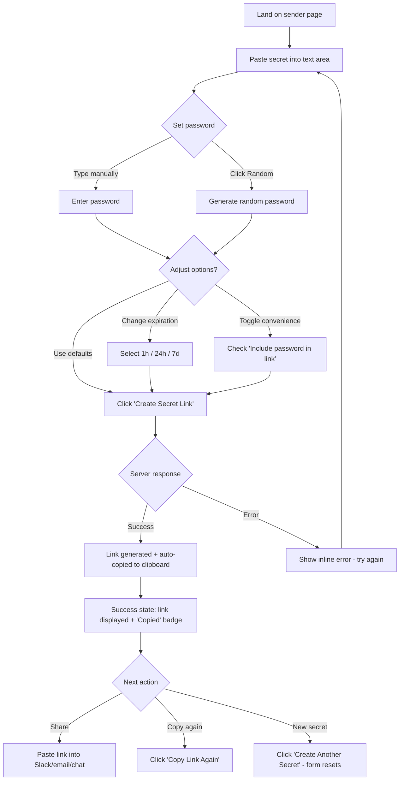
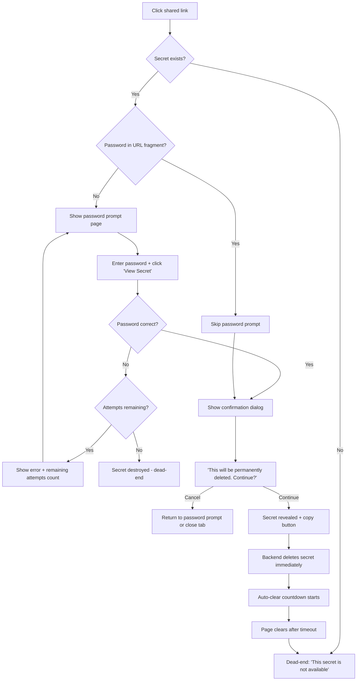
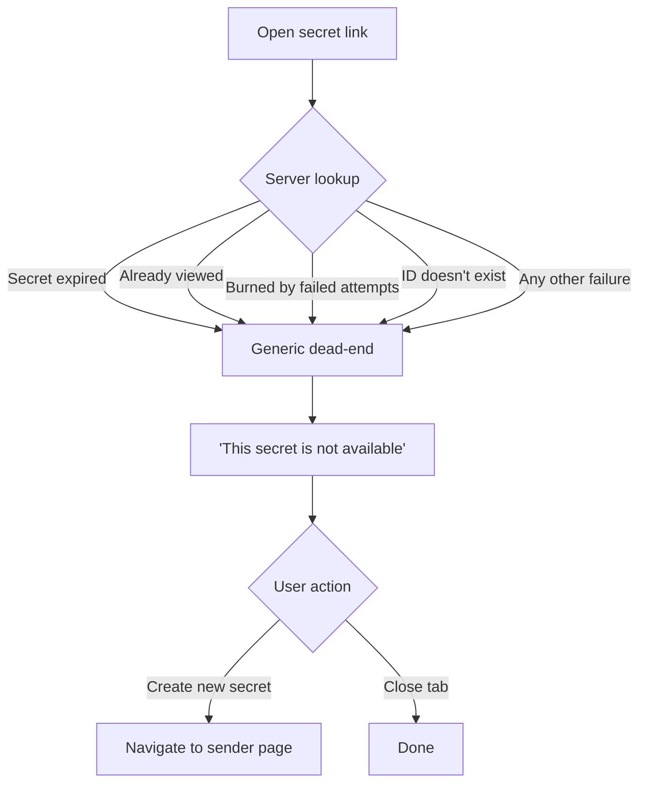

# UX Design Specification Securer

**Author:** Nick
**Date:** 2026-02-13

---

## Executive Summary

### Project Vision

Securer (Secret Drop) is a self-hosted, zero-knowledge, one-time secret sharing web application. The UX vision is radical simplicity — a single-page experience where sharing a secret is faster than pasting into Slack. No accounts, no navigation, no friction. The interface must communicate security and trust while remaining invisible to the workflow. Paste, protect, share, done.

### Target Users

- **Developers (Alex)** — Daily credential sharers who need speed above all. Currently default to Slack DMs because nothing else is as fast. Will adopt Secret Drop only if it's genuinely quicker and zero-friction.
- **Team Leads (Dana)** — Distribute credentials during onboarding to people with varying technical skill. Need a tool that requires zero explanation for recipients. Password-in-link convenience mode is critical for this persona.
- **Non-Technical Recipients (Sam)** — Receive secrets via links, may not understand encryption, and shouldn't need to. The experience must be self-explanatory: click link, enter password, see secret, done.
- **Instance Admins (Chris)** — Deploy and forget. No admin UI needed. UX concern is limited to Docker setup simplicity.

### Key Design Challenges

- **Trust at first glance** — Recipients land on an unfamiliar link and must immediately feel safe. The UI must communicate "security tool" without looking sketchy or over-designed.
- **Two distinct mental models** — Senders need power-user efficiency; recipients need gentle guidance. One app serving two very different UX needs.
- **Communicating ephemerality** — Users must intuitively understand one-time-view destruction without creating anxiety or adding friction.
- **Opaque error states** — All failures show identical generic messages. Secure by design, but potentially frustrating for legitimate users who don't know what went wrong.

### Design Opportunities

- **"Faster than Slack" as UX benchmark** — If create flow genuinely feels faster than copy-pasting into chat, adoption follows naturally. Every interaction measured against this bar.
- **Trust through transparency** — A subtle "How does this work?" explanation converts skeptical recipients into future senders. The security model is the product's best marketing.
- **Progressive disclosure** — Dead-simple defaults (paste, password, generate) with options like expiration and password-in-link tucked behind sensible defaults. Power users discover them; casual users aren't overwhelmed.

## Core User Experience

### Defining Experience

The core experience is the "paste, protect, share" sender loop — completed in under 10 seconds. A single-page form where the sender pastes a secret, provides a password, and generates a shareable link that's instantly copied to clipboard. The recipient experience is equally critical but secondary in frequency: open link, enter password, view secret, done. Both flows must feel like they take zero effort.

### Platform Strategy

- **Web SPA** — Single-page application, no routing complexity for the sender flow
- **Desktop-first, mobile-ready** — Senders typically on desktop; recipients may open links on any device
- **Modern browsers only** — Last 2 versions of Chrome, Firefox, Safari, Edge. Enables Clipboard API, modern CSS, ES2020+
- **No offline requirement** — Secrets require server interaction by design
- **No native capabilities needed** — Pure web, no camera/GPS/notifications

### Effortless Interactions

- **Auto-copy to clipboard** — Link copied the instant it's generated. No extra click.
- **Smart defaults** — 24h expiration pre-selected, password field focused on load. Common case requires minimal decisions.
- **Password-in-link toggle** — Single checkbox eliminates the "how do I share the password?" problem for non-technical recipients.
- **Zero-context recipient flow** — Password field, submit, view. No explanation needed, no onboarding, no branding wall.
- **Random password generator** — One click produces a strong password, removing friction for senders who don't want to think of one.

### Critical Success Moments

- **The clipboard moment** — Sender clicks Generate, link is on clipboard. If this feels instant, adoption follows.
- **Recipient's first reveal** — Password entered, confirmation acknowledged, secret appears. Trust is built or broken here.
- **The "it's gone" realization** — Recipient revisits the link and sees the dead-end. Proof that ephemerality works. Converts recipients into senders.
- **The failed attempt dead-end** — Wrong password or expired link hits the same generic wall. Security feels real and trustworthy.

### Experience Principles

1. **Speed is the feature** — Every interaction measured against "is this faster than pasting into Slack?" If not, cut or redesign.
2. **Trust through restraint** — The less the UI does, the more trustworthy it feels. Absence of complexity signals security.
3. **Self-evident for strangers** — Recipients have zero context. Every screen must be instantly understandable without explanation.
4. **Destroy with confidence** — Ephemerality is the core promise. Destruction must feel deliberate, visible, and reassuring — not alarming.

## Desired Emotional Response

### Primary Emotional Goals

- **Confidence** — "I did the right thing using this." Users should feel they made a smart, secure choice without any extra effort.
- **Relief** — "It's handled." After sharing a secret, the lingering worry about credentials sitting in chat logs is gone.
- **Trust** — "This looks and feels legitimate." The design must visually communicate credibility — clean, professional, purposeful. Not shady, not thrown together. A tool you'd trust with real credentials.

### Emotional Journey Mapping

| Stage | Desired Emotion | Design Implication |
|---|---|---|
| First discovery (recipient) | Curiosity → quick trust | Clean, professional UI that immediately signals legitimacy. No ads, no clutter, no dark patterns. |
| Sender flow | Flow state / efficiency | So fast there's no time to feel friction. Paste, protect, share — done. |
| After sharing | Relief and calm | Confirmation that the secret is protected and will self-destruct. Clean closure. |
| Error / dead-end | Acceptance, not frustration | Firm but not hostile. Generic message feels intentional, not broken. |
| Return visit | Familiarity | Zero relearning. "I know exactly what to do." |

### Micro-Emotions

- **Confidence over confusion** — Every screen immediately clear in purpose and action
- **Trust over skepticism** — Visual design must earn trust at first glance, especially for recipients landing on an unknown link. Professional typography, restrained color, purposeful layout.
- **Calm over anxiety** — Security tools often create stress. This should feel like locking your front door — routine, not alarming.
- **Clean over cluttered** — The absence of unnecessary elements signals competence and respect for the user's time.

### Design Implications

- **Trust = visual quality** — Typography, spacing, and color palette must feel polished and intentional. A security tool that looks amateur undermines its own promise. Invest in visual credibility.
- **Confidence = clarity** — Large, readable form elements. Clear labels. Obvious primary action. No guessing what to do next.
- **Relief = closure signals** — After generating a link, clear visual confirmation: "Your secret is encrypted and ready to share." The user knows it's done.
- **Calm = restraint** — Minimal animation, no aggressive colors, no urgency tricks. Quiet competence.
- **Acceptance on error = tone** — Dead-end messages should feel neutral and secure, not apologetic or broken. "This secret is not available." Period.

### Emotional Design Principles

1. **Credibility is visual** — The design must look trustworthy before users read a single word. Professional, clean, purposeful. If it looks shady, nobody will paste their API keys into it.
2. **Calm confidence, not security theater** — No padlock icons everywhere, no "MILITARY GRADE ENCRYPTION" banners. Quiet, competent design that lets the security model speak for itself.
3. **Closure over ambiguity** — Every action should have a clear emotional endpoint. Sender knows the secret is protected. Recipient knows the secret is gone.
4. **Respect through simplicity** — Every unnecessary element erodes trust. The design earns respect by not wasting the user's time or attention.

## UX Pattern Analysis & Inspiration

### Inspiring Products Analysis

**Google Search — The Trust Benchmark**
The definitive example of radical simplicity at scale. A single input on a white canvas, surrounded by vast whitespace. Billions of people trust it instantly without thinking. Key lessons: whitespace communicates confidence, a single focal point eliminates decision paralysis, and speed reinforces trust. Securer's sender form should evoke this same "one field, one action, total clarity" feeling.

**Apple Product Pages — Futuristic Clean**
White canvas, generous spacing, typography as the primary design element. Minimal UI chrome — no boxes, no borders, no clutter. The design feels modern, premium, and forward-looking. Securer should borrow this aesthetic sensibility: let whitespace and type do the work, not decorative elements.

**Linear — Developer Trust Through Design**
A modern developer tool that earns trust through visual polish. Clean white interface, subtle animations, restrained color palette. Proves that developer tools don't need to look utilitarian — they can feel futuristic and still be taken seriously.

### Transferable UX Patterns

**Layout Patterns:**
- Dominant whitespace with a single centered form element — the Google Search bar model
- Vertical rhythm with generous spacing between form fields
- Content centered on the page with wide margins, not edge-to-edge

**Visual Patterns:**
- Typography-driven hierarchy — headings, labels, and body text do the heavy lifting instead of boxes and borders
- Single accent color against a clean white background for CTAs and key interactions
- Soft, subtle shadows and rounded corners for depth — modern and approachable, not flat or harsh

**Interaction Patterns:**
- Immediate feedback — link generated and copied in one click, no intermediate states
- Progressive disclosure — advanced options (expiration, password-in-link) secondary to the core input
- Minimal state changes — the page doesn't rebuild or navigate; content appears in place

### Anti-Patterns to Avoid

- **Dark hacker aesthetic** — Black backgrounds, green monospace text, terminal styling. Alienates non-technical recipients and signals "underground," not "trustworthy."
- **Security theater visuals** — Shield icons, padlock badges, "military-grade encryption" banners. Overcompensating with security imagery erodes the trust it's trying to build.
- **Cluttered feature UIs** — Dashboards, sidebars, navigation menus. Every additional element dilutes the single-purpose clarity.
- **Generic bootstrap look** — Default component library styling signals "side project," not "trust me with your credentials."
- **Aggressive color schemes** — Bright reds, warning yellows, high-contrast alerts for normal states. Save intensity for actual warnings.

### Design Inspiration Strategy

**Adopt:**
- Google Search's whitespace-dominant, single-input layout philosophy
- Apple's typography-first, chrome-free visual hierarchy
- Linear's proof that developer tools can look futuristic and polished

**Adapt:**
- Google's centered layout adapted to a short vertical form (text area + 3-4 fields + button)
- Apple's generous spacing scaled to a functional form that still feels airy, not wasteful
- Modern glassmorphism or subtle depth cues to feel 2026-futuristic without being gimmicky

**Avoid:**
- Any visual element that signals "hacker tool" or "security paranoia"
- UI chrome that adds visual weight without functional purpose
- Anything that makes the tool look like a weekend project rather than a professional-grade utility

## Design System Foundation

### Design System Choice

**Tailwind CSS + Headless UI / Shadcn/ui** — A utility-first CSS framework paired with accessible, customizable component primitives. This combination provides full visual control to achieve the futuristic, clean white aesthetic while leveraging proven, accessible component patterns.

### Rationale for Selection

- **Full visual control** — Utility-first approach means no fighting framework defaults. The Google-like whitespace-dominant aesthetic is achievable without overriding opinionated styles.
- **Solo developer speed** — Pre-built component primitives (Shadcn/ui) eliminate boilerplate while remaining fully owned and customizable. Copy-paste model, not a dependency.
- **No "generic" look** — Unlike Material UI or Bootstrap, Tailwind produces no recognizable "framework look." Every app looks custom.
- **Modern defaults** — Shadcn/ui components are built on Radix primitives with accessibility baked in. Keyboard navigation, screen readers, and focus management handled out of the box.
- **Community and ecosystem** — Massive adoption, excellent documentation, abundant examples. Solo developer won't get stuck.
- **Minimal bundle** — Tailwind purges unused CSS. Final bundle stays tiny, supporting the performance requirements.

### Implementation Approach

- **Tailwind CSS** as the styling foundation — utility classes for layout, spacing, typography, color
- **Shadcn/ui** for interactive components — buttons, inputs, dropdowns, dialogs, toasts
- **Radix UI primitives** under the hood for accessibility compliance
- **CSS custom properties** for design tokens (colors, spacing scale, typography scale) enabling easy theming
- **No additional CSS framework** — Tailwind is the single source of truth for styling

### Customization Strategy

- Define a custom Tailwind theme matching the futuristic white aesthetic: extended color palette, custom spacing scale, typography choices
- Override Shadcn/ui component defaults to match the design vision — softer shadows, more whitespace, refined border radius
- Create a small set of project-specific component variants (form inputs, buttons, cards) as the design language
- Design tokens centralized in Tailwind config for single-source consistency

## Defining Core Experience

### Defining Experience

**"Paste a secret, get a self-destructing link."**

The entire product value in one action, one screen. Like Snapchat's disappearing photos but for credentials. Users describe it as: "Just Secret Drop it." The sender pastes something sensitive, clicks one button, and gets a link that works exactly once. If this interaction feels faster than pasting into a Slack DM, adoption is guaranteed.

### User Mental Model

**Sender mental model: "I'm putting this in a safe that only one person can open once."**
- Familiar pattern: paste text into a field (like any chat or form)
- New twist: the output isn't a message — it's a self-destructing link
- Existing habit: copy-paste into Slack DM. Securer must slot into this same muscle memory but redirect the output from "message" to "secure link"

**Recipient mental model: "I'm opening a sealed envelope."**
- Familiar pattern: click a link, enter a password (like any login)
- New twist: the content disappears after viewing — the envelope burns
- No prior knowledge of the tool required. The interaction teaches itself

**Key insight:** Both mental models map to real-world metaphors users already understand. No novel concepts to teach — just a digital version of something physical and intuitive.

### Success Criteria

- **Speed benchmark:** Sender completes paste-to-link in under 10 seconds on first use, under 5 seconds on repeat use
- **Zero-thought test:** Recipient retrieves a secret without reading any instructions or help text
- **Clipboard confidence:** After clicking Generate, the sender's next action is pasting the link into their communication channel. The link must be on the clipboard without any additional step.
- **"It just works" feeling:** No loading spinners, no page transitions, no confirmation emails. Instant.
- **Trust at first sight:** A recipient landing on an unknown Secret Drop link feels safe enough to enter a password within 5 seconds

### Novel UX Patterns

**Pattern type: Established patterns with a unique twist**

Securer uses entirely familiar interaction patterns — form input, button click, password prompt — combined in a novel way:

- **Familiar:** Text area, dropdown, password field, submit button (every web form ever)
- **Familiar:** Click a link, enter a password (every login page ever)
- **Novel twist:** The output is ephemeral. One view, then gone. This is the only concept users need to learn, and the UI communicates it through confirmation dialogs and clear destruction messaging.

**No user education needed** for the core flow. The only new concept — ephemerality — is communicated through:
- Confirmation before reveal: "This will be permanently deleted after you view it"
- Dead-end on revisit: "This secret is not available"
- These are encountered naturally, not taught upfront

### Experience Mechanics

**1. Initiation (Sender)**
- User lands on a single page — the form is immediately visible, no scrolling, no navigation
- Text area is the dominant element, inviting the paste action
- Password field and options are visible but secondary

**2. Interaction (Sender)**
- Paste secret text into the text area
- Enter a password (or click to generate a random one)
- Optionally adjust expiration (default: 24h) or toggle password-in-link
- Click Generate

**3. Feedback (Sender)**
- Link appears instantly with "Copied to clipboard" confirmation
- Clear visual state change: form collapses or transitions to a "success" state showing the link
- No ambiguity — the sender knows the secret is encrypted and the link is ready

**4. Completion (Sender)**
- The link is on the clipboard. The sender's next action is pasting it into their communication channel.
- Option to create another secret immediately (reset form)

**5. Initiation (Recipient)**
- Clicks the shared link, lands on a minimal page: password field + submit (or straight to confirmation if password-in-link)

**6. Interaction (Recipient)**
- Enters password, clicks submit
- Sees confirmation: "This will be permanently deleted. Continue?"
- Clicks Continue

**7. Feedback (Recipient)**
- Secret content appears with copy button
- Clear messaging that this is a one-time view

**8. Completion (Recipient)**
- Copies the secret content
- Page auto-clears after countdown (cosmetic — backend already deleted)
- Revisiting the link shows the generic dead-end: "This secret is not available"

## Visual Design Foundation

### Color System

**Primary Palette — "Clean Futurism"**

- **Background:** `#FFFFFF` (pure white) with `#FAFAFA` for subtle section differentiation
- **Text Primary:** `#0A0A0A` (near-black) — high contrast, sharp, modern
- **Text Secondary:** `#6B7280` (cool gray) — for labels, hints, secondary info
- **Accent Primary:** `#6366F1` (Indigo 500) — modern, trustworthy, distinctive. Used for the Generate button, links, and key interactions
- **Accent Hover:** `#4F46E5` (Indigo 600) — deeper on interaction
- **Success:** `#10B981` (Emerald 500) — for "Copied to clipboard" and confirmation states
- **Error:** `#EF4444` (Red 500) — for failed password attempts, used sparingly
- **Warning:** `#F59E0B` (Amber 500) — for destruction confirmations
- **Surface:** `#F9FAFB` (Gray 50) — subtle card/form backgrounds when needed
- **Border:** `#E5E7EB` (Gray 200) — ultra-subtle form field borders

**Rationale:** Indigo as the accent color hits the intersection of "modern tech" and "trustworthy institution." It's the color of Linear, Stripe's docs, and Vercel — products developers already trust. It avoids the generic blue of older tools while steering clear of trendy colors that age fast.

**Semantic Color Mapping:**
| Role | Color | Usage |
|---|---|---|
| Primary Action | Indigo 500 | Generate button, primary links |
| Positive Feedback | Emerald 500 | Clipboard confirmation, success states |
| Destructive Warning | Amber 500 | "This will be deleted" confirmations |
| Error State | Red 500 | Failed password attempts counter |
| Neutral/Dead-end | Gray 400 | "This secret is not available" messaging |

### Typography System

**Font Family:**
- **Primary:** Inter — the modern default for developer tools. Geometric, highly legible, excellent at all sizes, variable font support for fine weight control
- **Monospace (secret display):** JetBrains Mono — for displaying revealed secrets, especially code/JSON/YAML. Clean, modern monospace that signals "this is code"

**Type Scale (based on 1.25 ratio):**
| Level | Size | Weight | Usage |
|---|---|---|---|
| Display | 2.5rem (40px) | 600 | App title / hero text |
| H1 | 2rem (32px) | 600 | Page headings |
| H2 | 1.5rem (24px) | 600 | Section headings |
| Body Large | 1.125rem (18px) | 400 | Form labels, key instructions |
| Body | 1rem (16px) | 400 | General text, descriptions |
| Small | 0.875rem (14px) | 400 | Hints, metadata, secondary info |
| Tiny | 0.75rem (12px) | 500 | Badges, counters, fine print |

**Line Heights:**
- Headings: 1.2
- Body: 1.6
- Compact (labels): 1.4

**Font Loading:** Variable font with `font-display: swap` for instant rendering. No layout shift.

### Spacing & Layout Foundation

**Base Unit:** 8px — all spacing derived from this

**Spacing Scale:**
| Token | Value | Usage |
|---|---|---|
| xs | 4px | Inline icon gaps, tight padding |
| sm | 8px | Form field internal padding |
| md | 16px | Between form labels and fields |
| lg | 24px | Between form groups |
| xl | 32px | Between major sections |
| 2xl | 48px | Page section separation |
| 3xl | 64px | Top/bottom page margins |

**Layout Principles:**
- **Centered single-column** — Content maxes out at 480px width for the form, centered on the page with generous margins. Like Google's search bar.
- **Vertical flow** — Everything stacks vertically. No multi-column form layouts. Simple, scannable, top-to-bottom.
- **Breathing room** — Minimum 24px between form elements. The page should feel 60% whitespace.
- **No chrome** — No header bar, no sidebar, no footer navigation. The form floats in space. App name and a subtle "How does this work?" link are the only non-form elements.

**Grid System:**
- No formal grid needed — single column, centered
- Max content width: 480px (form), 600px (secret display/reveal)
- Responsive breakpoints: 640px (mobile), 768px (tablet), 1024px+ (desktop)
- Below 640px: form goes full-width with 16px horizontal padding

### Accessibility Considerations

- **Contrast ratios:** All text meets WCAG 2.1 AA minimum (4.5:1 for body, 3:1 for large text). Near-black on white exceeds this significantly.
- **Focus indicators:** Visible focus rings using the indigo accent color (2px solid with 2px offset). Keyboard navigation fully supported via Radix/Shadcn primitives.
- **Font sizing:** Base 16px, never below 12px. All sizes in rem for user scaling.
- **Touch targets:** Minimum 44x44px for all interactive elements on mobile.
- **Color independence:** No information conveyed by color alone. Error states use text + icon, not just red.
- **Reduced motion:** Respect `prefers-reduced-motion` — disable transitions and animations for users who prefer it.

## Design Direction Decision

### Design Directions Explored

Eight design directions were generated and evaluated as interactive HTML mockups:

**Sender Form Layouts:**
1. Ultra Minimal — Google-like whitespace with centered form
2. Card Elevated — Soft card on subtle background
3. Split Layout — Value proposition panel + form side by side
4. Floating Glass — Glassmorphism with gradient orbs and rounded edges

**Recipient & State Views:**
5. Password Prompt — Minimal, centered, trust-building
6. Secret Reveal — Warning banner, monospace content, copy button, countdown
7. Success State — Confirmation with copied link, expiration details, create-another action
8. Dead End — Generic message for all failure states, "create new" link

### Chosen Direction

**Hybrid: Split Layout (3) + Floating Glass Aesthetic (4)**

The sender experience uses a split-layout approach where:
- **Left panel** — Gradient background (indigo spectrum) with the product tagline, security model explanation, and feature checklist. Builds trust and communicates value for first-time visitors.
- **Right panel** — Glass-card form treatment with frosted glass effect, subtle background orbs, generous border radius, and soft shadows. Feels futuristic and premium.

**Recipient and state views (5-8)** remain as designed — centered, minimal, single-purpose screens that prioritize clarity over visual complexity.

### Design Rationale

- **Split layout solves the trust problem** — Recipients and first-time senders see the security explanation without it competing with the form. The value prop is always visible but never in the way.
- **Glass aesthetic delivers "very modern"** — Frosted backgrounds, gradient orbs, and large border radii feel distinctly 2026. Premium without being decorative.
- **Rounded edges signal approachability** — Larger border radii (16-24px) feel friendly and modern, countering the cold/intimidating feel that security tools often have.
- **Recipient views stay minimal** — Recipients don't need the split layout or glass effects. They need clarity: password field, secret content, done. Less is more for these single-task screens.
- **Responsive gracefully** — Split layout stacks vertically on mobile (value prop above form), glass card adapts naturally to any width.

### Implementation Approach

**Sender Page (Split Layout + Glass):**
- CSS Grid or Flexbox two-column layout, 50/50 split
- Left column: gradient background (`linear-gradient(135deg, #4F46E5, #6366F1, #818CF8)`), white text, feature list
- Right column: subtle gradient background with blur orbs, glass-card form container (`backdrop-filter: blur(20px)`, `background: rgba(255,255,255,0.75)`, `border-radius: 24px`)
- Mobile breakpoint (<768px): stack vertically, left panel becomes a compact hero above the form

**Recipient Pages (Centered Minimal):**
- Single centered column on white background
- Max-width 380-520px depending on content
- Clean, no glass effects — let the content speak

**State Indicators:**
- Success: emerald green check icon, copied badge, link display
- Warning/Reveal: amber warning banner, countdown timer
- Dead End: neutral gray lock icon, generic message
- All states use the same centered, minimal layout pattern

**Shared Components (Tailwind + Shadcn/ui):**
- Form inputs: `rounded-md` (10px), subtle borders, indigo focus rings
- Primary button: `rounded-md`, solid indigo, full-width within form
- Secondary button: `rounded-md`, indigo outline
- Glass card: custom Tailwind utility class for the frosted effect

## User Journey Flows

### Sender Flow (Create Secret)

**Entry:** User navigates to the app's root URL. The split-layout sender page loads immediately.

**Covers:** Alex (developer sharing credentials), Dana (team lead onboarding with password-in-link)

**Key UX decisions:**
- No page navigation — form transitions to success state in-place
- Auto-copy on generation eliminates the most common next step
- Default expiration (24h) means most users touch only 3 elements: text area, password, generate button
- Password-in-link checkbox is visible but unchecked by default (security-first default)

### Recipient Flow (Retrieve Secret)

**Entry:** Recipient clicks a shared link. Server determines which view to show based on URL and secret state.

**Covers:** Maria (standard password retrieval), Dana's recipients (password-in-link convenience), Sam (expired/viewed)

**Key UX decisions:**
- Password-in-link recipients skip straight to confirmation — zero friction for Dana's onboarding scenario
- Confirmation dialog before reveal is the last safety net — prevents accidental viewing (burning the secret)
- Attempt counter appears only after first failure — no intimidation on first visit
- Auto-clear is cosmetic reassurance — backend already deleted on serve
- Any revisit after viewing shows the same dead-end as expired/nonexistent (no information leakage)

### Failure Flow (All Error States)

**Entry:** Any link that resolves to a secret that is unavailable for any reason.

**Covers:** Sam (expired), brute force (burned), already viewed, nonexistent ID

**Key UX decisions:**
- Identical response for every failure state — this is a security requirement, not a UX compromise
- No "expired" vs "already viewed" vs "doesn't exist" differentiation — prevents information leakage
- Tone is neutral and matter-of-fact: "This secret is not available" — not apologetic, not alarming
- "Create a new secret" link provides a gentle exit path back to the sender flow
- No retry option — if the secret is gone, it's gone

### Journey Patterns

**Navigation Patterns:**
- **No navigation** — There is no nav bar, no menu, no routing between "pages." The app has exactly three URL patterns: root (sender), `/s/:id` (recipient), and that's it.
- **In-place transitions** — State changes happen within the same viewport. Sender form transitions to success state. Recipient password prompt transitions to confirmation to reveal. No page loads.

**Decision Patterns:**
- **Defaults-first** — Every decision has a sensible default. Expiration defaults to 24h. Password-in-link defaults to off. The only required decisions are: what's the secret, and what's the password.
- **Progressive options** — Advanced options (expiration, password-in-link) are visible but secondary. They don't compete with the core action.

**Feedback Patterns:**
- **Instant confirmation** — Every action produces immediate visual feedback. Generate → "Copied." Password correct → confirmation dialog. Copy → "Copied." No ambiguous waiting states.
- **Destruction messaging** — All destruction-related feedback uses the same calm, neutral tone. No red alerts, no exclamation marks. Just clear, factual statements.
- **Error restraint** — Errors reveal minimal information. Wrong password shows "Incorrect password" + attempt count. Everything else shows the generic dead-end.

### Flow Optimization Principles

1. **Minimum viable interaction** — Sender: paste + password + click = done (3 actions). Recipient with password-in-link: click link + confirm = done (2 actions). These are the theoretical minimums for secure secret sharing.
2. **No dead-end without an exit** — Every terminal state offers a path forward. Success → "Create another." Dead-end → "Create a new secret." Even the auto-clear → returns to dead-end with the create link.
3. **Fail fast, fail safe** — Wrong password feedback is immediate. Secret destruction on attempt exhaustion is immediate. Expiration cleanup is automatic. No lingering unsafe states.
4. **Zero-scroll flows** — Every state fits in a single viewport on desktop. No scrolling required to complete any action. On mobile, the sender form may require a short scroll, but the primary action (Generate) is always visible.

## Component Strategy

### Design System Components

**From Shadcn/ui (use directly or with minor theme overrides):**

| Component | Usage | Customization |
|---|---|---|
| Button | Generate, View Secret, Copy, Create Another | Indigo primary, outline secondary, full-width in forms |
| Input | Password field, URL display | Larger padding, indigo focus ring, rounded-md |
| Textarea | Secret text input | JetBrains Mono font, taller min-height, rounded-md |
| Select | Expiration dropdown (1h / 24h / 7d) | Match input styling, custom chevron |
| Checkbox | "Include password in link" toggle | Indigo accent color |
| Dialog | Confirmation before secret reveal | Centered, minimal, clear action buttons |
| Toast | "Copied to clipboard" notification | Emerald success variant, auto-dismiss 3s |

### Custom Components

**GlassCard**
- **Purpose:** Primary container for the sender form on the right panel
- **Anatomy:** Frosted glass background + subtle border + soft shadow + content slot
- **States:** Default only (no interactive states on the container itself)
- **Specs:** `backdrop-filter: blur(20px)`, `background: rgba(255,255,255,0.75)`, `border-radius: 24px`, `border: 1px solid rgba(255,255,255,0.8)`, soft box-shadow
- **Accessibility:** Semantic `<main>` or `<section>` with appropriate ARIA landmark

**SplitLayoutShell**
- **Purpose:** Page-level layout for the sender experience — gradient panel + form panel
- **Anatomy:** Left column (gradient background, tagline, feature list) + Right column (glass card with form)
- **States:** Desktop (side-by-side 50/50) → Mobile (stacked, left panel becomes compact hero)
- **Specs:** CSS Grid `grid-template-columns: 1fr 1fr`, breakpoint at 768px stacks to single column
- **Left panel:** `linear-gradient(135deg, #4F46E5, #6366F1, #818CF8)`, white text, feature checklist with checkmark icons
- **Accessibility:** Left panel is supplementary content (`role="complementary"`), right panel is main content (`role="main"`)

**PasswordRow**
- **Purpose:** Compound input combining password field with random password generator button
- **Anatomy:** Password input (flex: 1) + "Random" button (fixed width)
- **States:** Default, focused (input), generating (brief loading state on button)
- **Specs:** Flex row, 8px gap, button matches input height
- **Interaction:** Click "Random" → generates strong password → fills input → shows password temporarily (toggle visibility)
- **Accessibility:** Button has `aria-label="Generate random password"`, input has `type="password"` with visibility toggle

**SecretDisplay**
- **Purpose:** Displays revealed secret content with copy functionality
- **Anatomy:** Header bar (label + copy button) + content area (monospace text)
- **States:** Default (content visible), copied (copy button shows checkmark + "Copied")
- **Specs:** `background: var(--surface)`, `border: 1px solid var(--border)`, `border-radius: 10px`, content in JetBrains Mono 14px, `white-space: pre-wrap`, `word-break: break-all`
- **Accessibility:** Content area has `role="textbox"` + `aria-readonly="true"` + `aria-label="Secret content"`, copy button has `aria-label="Copy secret to clipboard"`

**CountdownTimer**
- **Purpose:** Shows remaining time before the reveal page auto-clears (cosmetic — backend already deleted)
- **Anatomy:** Text line: "This page will auto-clear in **Xs**"
- **States:** Counting down (updates every second), cleared (page transitions to dead-end)
- **Specs:** `font-size: 13px`, `color: var(--text-tertiary)`, bold amber for the countdown number
- **Accessibility:** `aria-live="polite"` for screen reader updates, `role="timer"`

**SuccessPanel**
- **Purpose:** Displays generated link with confirmation after secret creation
- **Anatomy:** Success icon + heading + description + link box (URL + copied badge) + metadata row (expiration, password required, one-time view) + action buttons (Create Another, Copy Link Again)
- **States:** Just created (copied badge green), copy again (brief flash on re-copy)
- **Specs:** Centered layout, max-width 480px, emerald success icon (64px circle), link box with `background: var(--surface)`, JetBrains Mono for URL
- **Accessibility:** Success icon has `aria-label="Success"`, link text is selectable, focus moves to link box on generation

**DeadEndScreen**
- **Purpose:** Generic terminal state for all secret unavailability scenarios
- **Anatomy:** Lock icon + heading ("This secret is not available") + description + "Create a new secret" link
- **States:** Single state only — intentionally identical for all failure reasons
- **Specs:** Centered layout, max-width 360px, gray lock icon (56px circle), neutral tone text
- **Accessibility:** Heading is `<h1>`, link is standard anchor to root URL

### Component Implementation Strategy

**Approach:**
- All custom components built as React components using Tailwind utility classes
- Shadcn/ui components imported and themed via Tailwind config — no CSS overrides
- Custom components follow the same API patterns as Shadcn/ui (props, variants, composition)
- All components are single-file, no external dependencies beyond Tailwind + Radix primitives

**Naming Convention:**
- Shadcn/ui components: use as-is (`Button`, `Input`, `Dialog`, etc.)
- Custom components: PascalCase, descriptive (`GlassCard`, `SecretDisplay`, `PasswordRow`, etc.)
- Layout components: suffixed with `Layout` or `Shell` (`SplitLayoutShell`)

**Testing Strategy:**
- Visual: manual review against design direction mockups
- Accessibility: automated axe-core checks + keyboard navigation testing
- Responsive: test at 640px, 768px, 1024px breakpoints

### Implementation Roadmap

**Phase 1 — Core (MVP launch):**
- SplitLayoutShell — page structure
- GlassCard — form container
- PasswordRow — password input with generator
- SuccessPanel — link generation confirmation
- DeadEndScreen — all error states
- Shadcn/ui: Button, Input, Textarea, Select, Checkbox, Toast

**Phase 2 — Recipient Experience (MVP launch):**
- SecretDisplay — revealed secret content
- CountdownTimer — auto-clear countdown
- Shadcn/ui: Dialog (confirmation before reveal)

**Phase 3 — Polish (Phase 1.5):**
- QR code display component (for link sharing)
- Syntax highlighting integration for SecretDisplay (code/JSON/YAML)
- "Copy with message" component (pre-written sharing text)
- About page layout component

## UX Consistency Patterns

### Button Hierarchy

**Primary Button**
- **When to use:** The single most important action on the screen. Only one primary button visible at a time.
- **Visual:** Solid indigo (`#6366F1`), white text, full-width within forms, `rounded-md`, 15px font, 600 weight
- **Hover:** Deeper indigo (`#4F46E5`)
- **Usage:** "Create Secret Link" (sender), "View Secret" (recipient), "Create Another Secret" (success)
- **Rule:** If there's only one button on the screen, it's primary.

**Secondary Button**
- **When to use:** Alternative actions alongside a primary button, or less critical standalone actions.
- **Visual:** Indigo outline, transparent background, indigo text, `rounded-md`
- **Hover:** Subtle indigo background tint (`#EEF2FF`)
- **Usage:** "Copy Link Again" (success state), "Cancel" in dialogs

**Ghost/Text Button**
- **When to use:** Tertiary actions, inline links, navigation-style actions
- **Visual:** Indigo text, no border, no background. Underline on hover.
- **Usage:** "How does this work?", "Create a new secret" (dead-end), "Random" password generator

**Button Rules:**
- Never more than one primary button visible at a time
- Destructive actions (confirming secret reveal) use primary button style — destruction is the intended action, not something to discourage
- All buttons minimum 44px height on mobile for touch targets
- Loading state: button text replaced with subtle spinner, button disabled

### Feedback Patterns

**Success Feedback**
- **Pattern:** Toast notification + inline state change
- **Visual:** Emerald green (`#10B981`) badge or toast, checkmark icon
- **Duration:** Toast auto-dismisses after 3 seconds
- **Usage:** "Copied to clipboard" (toast), copied badge on link box (inline)
- **Behavior:** Non-blocking — user can continue immediately

**Error Feedback**
- **Pattern:** Inline error below the relevant field
- **Visual:** Red text (`#EF4444`), no icons, subtle — not alarming
- **Duration:** Persists until user corrects the issue
- **Usage:** "Incorrect password" below password field, validation errors on sender form
- **Behavior:** Focus moves to the errored field

**Warning/Destruction Feedback**
- **Pattern:** Amber banner or dialog with clear consequence description
- **Visual:** Amber background (`#FFFBEB`), amber border (`#FDE68A`), dark amber text (`#92400E`)
- **Duration:** Persistent until user acknowledges
- **Usage:** "This secret will be permanently deleted after you view it" confirmation, "This secret has been permanently deleted from the server" post-reveal banner
- **Behavior:** Requires explicit user action to proceed

**Neutral/Informational Feedback**
- **Pattern:** Inline text, subdued styling
- **Visual:** Gray text (`#6B7280` or `#9CA3AF`), no background, no border
- **Usage:** "3 attempts remaining", countdown timer, expiration metadata
- **Behavior:** Informational only, no action required

**Feedback Rules:**
- Never use modals/dialogs for success feedback — too disruptive for a speed-focused tool
- Error messages are specific but minimal: "Incorrect password" not "The password you entered does not match our records"
- The dead-end screen is NOT an error — it's a neutral terminal state. No error styling, no red, no warning icons.

### Form Patterns

**Form Layout**
- Single column, vertical stack, top-to-bottom flow
- 18-20px gap between form groups
- Labels above inputs (not inline or floating)
- Labels: 14px, 500 weight, `#0A0A0A`

**Input Fields**
- Full-width within form container
- 12-16px internal padding
- 1px border (`#E5E7EB`), `rounded-md` (10px)
- Focus: indigo border + 3px indigo glow (`rgba(99,102,241,0.1)`)
- Placeholder text: `#9CA3AF`, descriptive but concise

**Textarea (Secret Input)**
- JetBrains Mono font (signals "code-friendly")
- Minimum 120px height, resizable vertically
- Same border/focus treatment as inputs

**Select Dropdown**
- Styled to match inputs (same padding, border, radius)
- Custom chevron icon (no native browser styling)
- Three static options only: 1 hour, 24 hours, 7 days

**Checkbox**
- Indigo accent color when checked
- Inline with label text, single row
- 18px checkbox size for accessibility

**Form Validation**
- Validate on submit, not on blur (speed over handholding)
- Required fields: secret text + password. Everything else has defaults.
- Error messages appear below the field, red text, no icons
- If secret text is empty: "Enter a secret to share"
- If password is empty: "Set a password to protect this secret"

**Form State Management**
- Form → submitting (button shows spinner) → success (transition to SuccessPanel) OR error (inline messages)
- No intermediate confirmation step for the sender — the submit IS the action
- Form resets cleanly on "Create Another Secret"

### Loading & Empty States

**Loading (Server Request in Progress)**
- **Sender submit:** Primary button shows subtle spinner, button disabled, form fields disabled. No full-page loader.
- **Recipient password check:** "View Secret" button shows spinner. No page-level loading.
- **Duration:** Under 500ms per PRD requirements. If somehow longer, spinner is sufficient — no skeleton screens needed for sub-second operations.

**Empty State**
- Not applicable in the traditional sense — the sender form IS the empty state, and it's the primary UI
- The text area placeholder ("Paste your secret here...") serves as the empty state instruction
- No empty dashboards, no "get started" flows, no onboarding

**Transition States**
- Sender form → Success: smooth fade/slide transition (in-place, no page navigation)
- Recipient password → Confirmation → Reveal: step-through transitions within the same viewport
- Auto-clear countdown → Dead-end: clean transition when timer expires
- All transitions respect `prefers-reduced-motion` (instant switch instead of animation)

### Modal & Dialog Patterns

**Confirmation Dialog (Pre-Reveal)**
- **Trigger:** Correct password entered (or password-in-link decoded)
- **Content:** Warning icon + "This secret will be permanently deleted after you view it. Continue?"
- **Actions:** "Continue" (primary button) + "Cancel" (secondary button)
- **Behavior:** Centered overlay with backdrop dim. Escape key or backdrop click = cancel.
- **Accessibility:** Focus trapped in dialog, `role="alertdialog"`, `aria-describedby` pointing to warning text

**Dialog Rules:**
- Only ONE dialog type in the entire app — the pre-reveal confirmation
- Never use dialogs for success, errors, or informational messages
- Dialog is the security checkpoint — it should feel deliberate, not annoying
- Keep dialog content minimal: one sentence of warning, two buttons. Nothing else.

## Responsive Design & Accessibility

### Responsive Strategy

**Desktop (1024px+):**
- Split layout: gradient info panel (left) + glass card form (right), 50/50
- Generous whitespace, centered content, full visual treatment
- All elements visible, no collapsing or hiding

**Tablet (768px - 1023px):**
- Split layout maintained but narrower proportions (40/60 or similar)
- Touch-optimized inputs (larger padding, 44px minimum touch targets)
- Same visual treatment as desktop, slightly tighter spacing

**Mobile (<768px):**
- **Left info panel hidden entirely** — skip straight to the form
- Single column, full-width form with 16px horizontal padding
- Glass card effect simplified (reduce blur for mobile GPU performance, or use solid white fallback)
- App name/logo shown as a compact header above the form
- All form elements stack vertically, full-width
- Primary button always visible without scrolling (sticky bottom if needed)

**Recipient views (all breakpoints):**
- Already single-column centered — naturally responsive
- No layout changes needed, just fluid width with max-width constraints
- Password prompt, reveal, success, dead-end all work identically across devices

### Breakpoint Strategy

| Breakpoint | Width | Layout Change |
|---|---|---|
| Mobile | < 768px | Info panel hidden, single-column form, compact header |
| Tablet | 768px - 1023px | Split layout maintained, tighter spacing |
| Desktop | 1024px+ | Full split layout with generous whitespace |

**Approach:** Desktop-first with `max-width` media queries to simplify down. Tailwind's responsive prefixes (`md:`, `lg:`) handle this natively.

**Key responsive rules:**
- Form max-width: 480px on desktop (within the right panel), full-width on mobile
- Secret display max-width: 520px on all breakpoints
- No horizontal scrolling at any breakpoint
- Font sizes stay consistent — no responsive font scaling needed (base 16px works everywhere)

### Accessibility Strategy

**Target:** WCAG 2.1 Level AA compliance

**Keyboard Navigation:**
- Full tab-through of all form elements in logical order (textarea → password → random button → expiration → checkbox → generate)
- Enter key submits the form from any field
- Escape closes the confirmation dialog
- Focus moves to success panel / error field after submission
- Visible focus indicators on all interactive elements (2px indigo ring)

**Screen Reader Support:**
- Semantic HTML: `<main>`, `<form>`, `<label>`, `<button>` — no `
` buttons
- All form fields have associated `<label>` elements (not just placeholder text)
- Password field has `aria-describedby` linking to hint text
- Success state announces "Secret link created and copied to clipboard" via `aria-live="assertive"`
- Countdown timer uses `aria-live="polite"` with `role="timer"`
- Dead-end screen heading is `<h1>` for immediate context
- Confirmation dialog uses `role="alertdialog"` with `aria-describedby`

**Color & Contrast:**
- All text exceeds 4.5:1 contrast ratio (near-black on white = ~18:1)
- Interactive element borders meet 3:1 against background
- Error states use text labels, not color alone
- Success states use checkmark icon + text, not green alone
- No information conveyed exclusively through color

**Motion & Animation:**
- All transitions respect `prefers-reduced-motion` media query
- Reduced motion: instant state changes instead of animations
- No auto-playing animations, no parallax, no decorative motion
- Countdown timer updates text only (no animated progress bar)

### Testing Strategy

**Responsive Testing:**
- Chrome DevTools device emulation for breakpoint verification
- Real device testing: iPhone (Safari), Android (Chrome), iPad (Safari)
- Test sender form at all breakpoints — ensure Generate button visible without scroll
- Test recipient flow on mobile — most common recipient device

**Accessibility Testing:**
- axe-core automated checks integrated into development workflow
- Keyboard-only navigation walkthrough of all flows
- VoiceOver (macOS/iOS) testing for screen reader compatibility
- Tab order verification on all pages/states
- Color contrast verification with browser dev tools

**Browser Matrix:**
| Browser | Priority | Notes |
|---|---|---|
| Chrome (last 2) | Primary | Desktop + Android |
| Safari (last 2) | Primary | iOS recipients will use this |
| Firefox (last 2) | Secondary | Desktop |
| Edge (last 2) | Secondary | Desktop |

### Implementation Guidelines

**Responsive Development:**
- Use Tailwind responsive prefixes (`md:`, `lg:`) — no custom media queries needed
- Mobile: `hidden md:flex` for the info panel — simple toggle
- Glass card: `backdrop-filter` with `@supports` fallback to solid white for older browsers
- Form container: `w-full max-w-md mx-auto` — centers and constrains naturally
- Test with actual thumb reach zones on mobile — Generate button should be in easy reach

**Accessibility Development:**
- Start with semantic HTML — `<form>`, `<label>`, `<button>`, `<input>` — before adding ARIA
- Use Radix/Shadcn primitives for Dialog and Select — accessibility built in
- Add `aria-live` regions for dynamic content (clipboard confirmation, countdown, attempt counter)
- Implement skip-to-main link (hidden until focused) for keyboard users
- Test every state transition with a screen reader before shipping
