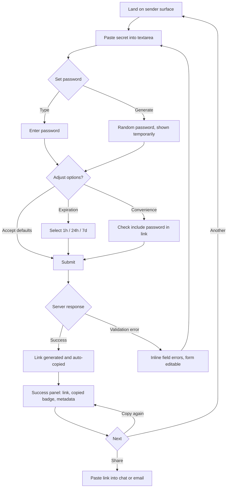
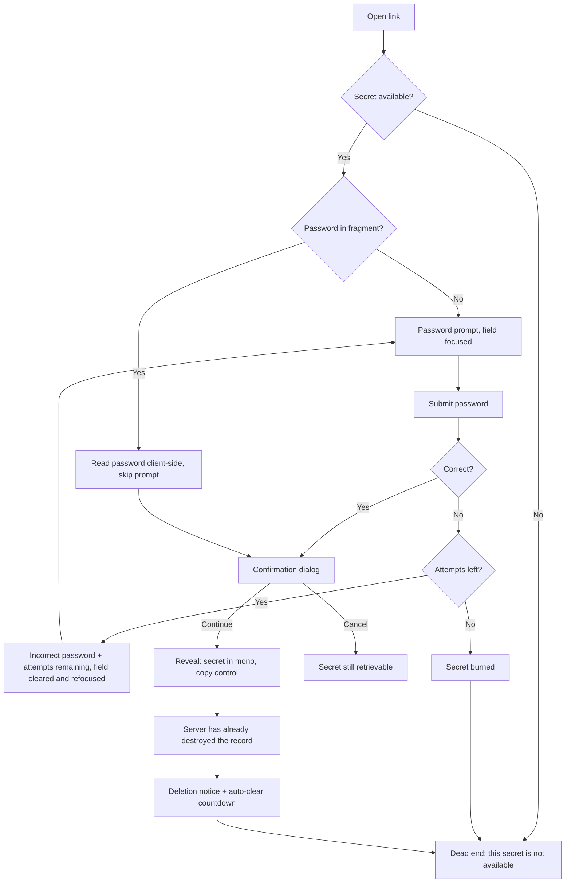
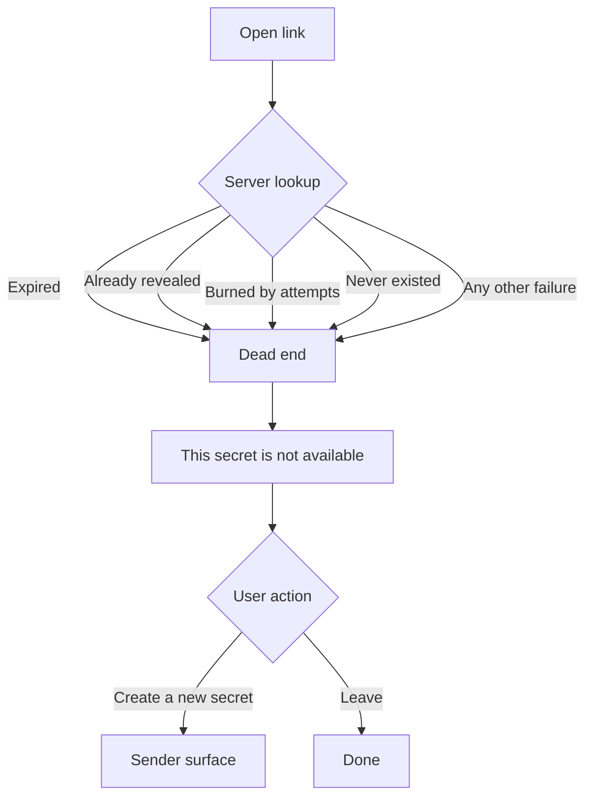

# EXPERIENCE.md — Securer

How the product works. `DESIGN.md` owns how it looks, and this file references its tokens by name as `{path.to.token}`. Both spines win over any mock, wireframe or import. Requirement ids (`FR-`, `NFR-`) and journey ids (`UJ-`) are owned by the PRD.

## Foundation

**Form factor.** Web, single-page, desktop-first. Senders are at a keyboard (UJ-1, UJ-3); Recipients open Links wherever they happen to be, frequently a phone (UJ-3, UJ-4). Both must work; neither is an afterthought.

**UI system.** Blazor (InteractiveServer) with Tailwind CSS v4, no component library. Components are custom `.razor` files styled with Tailwind utilities; `DESIGN.md` tokens live in the Tailwind theme.

This supersedes the React + Tailwind + shadcn/ui assumption these spines were originally drafted against — the architecture spine (`AD-21`) fixes Blazor InteractiveServer as the render mode, and the tooling half of the earlier UX decision does not survive that. What does survive is the reasoning: Tailwind was chosen because it produces no recognizable framework look, and a generic component-library appearance would undercut the trust this product depends on. That argument holds identically under Blazor, and rules out MudBlazor, Radzen and FluentUI Blazor for the same reason it ruled out Material and Bootstrap.

The cost of dropping shadcn/Radix is real and lands here: the keyboard handling, focus management and screen-reader semantics that came free from Radix primitives are now this file's obligation. Every behavior in `## Accessibility Floor` must be implemented and tested rather than inherited — see the note under Component Patterns for the two components where that cost concentrates.

**Visual identity.** `DESIGN.md`. Nothing here restates a color, size or radius.

**No offline mode.** Every operation requires the server by design. There is nothing meaningful to do with a cached page.

**No native capability.** No camera, location, notifications or install prompt. The clipboard is the only platform API the product depends on, and it degrades (see Interaction Primitives).

## Information Architecture

Three surfaces. There is no navigation, no menu, no breadcrumb, and no way to get lost, because there is nowhere else to be.

| Surface | Route | Purpose | Journeys |
|---|---|---|---|
| Sender | `/` | Create a Secret and receive a Link | UJ-1, UJ-3 |
| Recipient | `/s/{id}` | Supply a Password, confirm, view a Secret once | UJ-2, UJ-3, UJ-5 |
| Dead end | `/s/{id}` (unavailable) | State that a Secret is not available | UJ-4, UJ-5 |

The dead end is not a fourth route. It is what the Recipient route renders whenever a Secret is unavailable for any reason — which is what makes FR-21 and FR-22 achievable rather than aspirational.

**Surface closure.** Every stated need has a surface, and every surface is reached by a journey: creation lands on Sender, retrieval on Recipient, every failure on the dead end. Deployment (UJ-6) has deliberately no surface — the Instance Administrator's success is that no page exists for them.

**In-surface state, not navigation.** State advances within the viewport. The Sender form becomes the success panel in place. The Recipient walks prompt → confirmation → reveal without a page load. Nothing pushes history, so the browser back button never lands a user in a half-finished flow.

## Voice and Tone

Brand voice lives in `DESIGN.md`. This section governs microcopy.

**Register.** Factual and calm. Short declaratives. No exclamation marks anywhere in the product. The interface never apologizes and never congratulates.

**Destruction language is plain.** "This secret will be permanently deleted after you view it." Not "careful!", not "warning!", not "are you sure?". Ephemerality is the product working correctly, so the copy states it as a fact.

**The dead-end message is exactly one sentence and never varies:** "This secret is not available." No cause, no elaboration, no suggestion about what might have happened. This is a security requirement (FR-21, FR-22), so the copy is frozen — any well-meaning attempt to be more helpful here reintroduces the oracle the product removed.

**Errors are minimal but specific.** "Incorrect password" — not "The password you entered does not match our records." Validation says "Enter a secret to share" and "Set a password to protect this secret".

**No security vocabulary in the UI.** No "military-grade", no "bank-level", no "encrypted with AES-256". The mechanism belongs on the explainer, not in the form. Claims about strength read as compensation.

**Confirmations state completion, not praise.** "Copied to clipboard." "This secret has been permanently deleted from the server."

## Component Patterns

Visual specs are in `DESIGN.md.Components`. This section is behavior.

Because there is no primitive library (see Foundation), the two components that would have come from Radix — the confirmation **dialog** and the expiration **select** — carry hand-written accessibility behavior. They are the highest-risk components in the product for an accessibility regression, and their requirements below are obligations rather than descriptions.

**PasswordRow** — a Password input with a "Random" generator beside it. Activating the generator fills the field with a strong random Password (FR-4) and reveals it temporarily, because a Sender cannot share a Password they have never seen. Visibility is togglable; the field is `type="password"` by default. The generator button carries `aria-label="Generate random password"`. A generated value stays editable.

**Secret textarea** — the dominant element on the Sender surface, in mono to signal that pasted content survives intact. Vertically resizable, never auto-shrinking below its minimum. Newlines, tabs and non-ASCII round-trip unchanged (FR-1).

**Expiration select** — exactly three options; 24 hours preselected (FR-2). With no primitive library (see Foundation), a native `<select>` is the default choice precisely because the platform supplies the keyboard and screen-reader behavior; a custom-styled listbox is only acceptable if it reimplements arrow-key navigation, type-ahead, `aria-activedescendant` and focus return, and is tested against them.

**Password-in-link checkbox** — unchecked by default (FR-5). The default is the secure one; the convenience mode is always an explicit act.

**Primary button** — one per surface. Shows a spinner in place of its label while a request is in flight, and disables itself and its form. Never blocks the page with an overlay.

**SecretDisplay** — the revealed Secret with a copy control (FR-11, FR-12). `role="textbox"`, `aria-readonly="true"`, `aria-label="Secret content"`. Content wraps rather than overflowing, so a long token stays fully visible. Text remains selectable so a blocked clipboard write is never a dead end.

**SuccessPanel** — success icon, heading, the Link in mono, a copied badge, and metadata: Expiration, whether a Password is required, one-time view. Focus moves here on generation so a keyboard or screen-reader user learns the outcome without hunting. Offers "Copy Link Again" and "Create Another Secret".

**CountdownTimer** — "This page will auto-clear in Xs" with `aria-live="polite"` and `role="timer"`. Purely cosmetic reassurance: the server destroyed the record when it served the Reveal. It must never imply the countdown is what deletes the Secret.

**DeadEndScreen** — lock icon, `<h1>` heading, and a "Create a new secret" link to `/`. Single state by construction — there is no variant to select, which is how the uniformity survives future edits.

**Confirmation dialog** — the only dialog in the product. `role="alertdialog"`, `aria-describedby` on the warning text, focus trapped, Escape and backdrop click both cancel. "Continue" is the primary action and "Cancel" the secondary.

**Toast** — clipboard confirmation only, auto-dismissing, non-blocking.

## State Patterns

**Loading.** Inline and local: the submitting button becomes a spinner, its form disables. No page-level loader, no skeleton screens — operations are sub-500ms (NFR-2, NFR-3), and a skeleton for a 300ms wait is slower-feeling than nothing.

**Success.** Toast plus an inline state change, never a dialog. Success must not interrupt a speed-focused flow.

**Error.** Inline, below the field it concerns, persisting until corrected. Focus moves to the offending field. Errors carry a text label, never color alone.

**Destruction.** The amber warning treatment, and only for irreversible action: the pre-reveal confirmation and the post-reveal deletion notice. Requires an explicit act to proceed.

**Neutral / informational.** Subdued text, no fill or border: the attempts-remaining counter, the countdown, Expiration metadata.

**Empty.** There is no traditional empty state. The Sender form *is* the initial state and it is the primary UI. The textarea placeholder ("Paste your secret here…") carries the instruction. No dashboards, no onboarding, no getting-started flow.

**Terminal.** Two: the success panel and the dead end. Both offer a path onward, so no state is a cul-de-sac.

**Attempts remaining** appears only after the first failed attempt (FR-16). Showing a budget on arrival frames a legitimate Recipient as a suspect.

**Validation** fires on submit, not on blur. Required: Secret text and Password. Everything else has a working default, so the common case is three interactions — paste, password, generate.

## Interaction Primitives

**Auto-copy** (FR-7). The Link reaches the clipboard on generation, without a further click, because the Sender's genuine next action is pasting it into a chat window. The Link is also rendered with a manual copy control, since a browser may refuse a clipboard write outside a user-gesture context — the fallback is a requirement, not a nicety.

**Defaults carry the flow.** Expiration defaults to 24h, password-in-link defaults to off. The only decisions the product insists on are what the Secret is and what the Password is.

**Progressive disclosure.** Expiration and password-in-link are visible but subordinate. They are not hidden behind a disclosure — hiding them would make the security-relevant choice feel optional — but they never compete with the primary action.

**Enter submits** from any field on both the Sender and Recipient surfaces.

**Escape** closes the confirmation dialog and cancels the Reveal.

**Fragment reading.** In password-in-link mode the Password is read from `window.location.hash` client-side and never placed in a path, query string, or referrer (FR-9, NFR-11).

**Confirmation is never skipped.** Password-in-link removes the prompt, never the warning (FR-10). It is the only thing between a click and an irreversible Reveal, and it survives every convenience path.

**Motion is functional only.** In-place transitions between states, nothing decorative, no parallax, no autoplay. Every transition honors `prefers-reduced-motion` by switching instantly instead.

**Zero-scroll target.** Every state fits one desktop viewport. On mobile the Sender form may scroll, but the primary button stays reachable.

**Minimum interaction count.** Sender: paste, Password, click — three. Recipient in password-in-link mode: open, confirm — two. These are the floors for the guarantees the product makes, and no addition may raise them.

## Accessibility Floor

Target: **WCAG 2.1 Level AA**. Visual contrast is `DESIGN.md`'s responsibility; this is the behavioral floor.

**Keyboard.** Every surface is fully operable without a pointer. Sender tab order is textarea → Password → Random → Expiration → checkbox → submit. Enter submits, Escape cancels the dialog. Focus is visible on every interactive element. Focus moves deliberately: to the success panel on generation, to the offending field on error, into the dialog on open and back to its trigger on cancel.

**Semantics.** Real HTML first — `<main>`, `<form>`, `<label>`, `<button>`, `<input>` — with ARIA only where the platform has no equivalent. Every field has a real `<label>`; a placeholder is never the only label. The Password field describes itself via `aria-describedby`.

**Announcements.** Link generation announces via `aria-live="assertive"` ("Secret link created and copied to clipboard") because the outcome is the point of the interaction. The countdown and the attempts counter use `aria-live="polite"`. The dead-end heading is an `<h1>` so a screen-reader user gets context immediately.

**Independence from color.** No state is conveyed by color alone. Errors pair text with their styling; success pairs a checkmark with its text.

**Targets.** Minimum 44×44px for every interactive element on touch.

**Text scaling.** All sizes in rem, base 16px, nothing below 12px, no maximum-scale lock.

**Motion.** `prefers-reduced-motion` disables transitions rather than shortening them. The countdown updates its text only; no animated progress bar.

**Skip link.** Hidden until focused, for keyboard users.

## Responsive & Platform

| Breakpoint | Width | Behavior |
|---|---|---|
| Mobile | < 768px | Gradient info panel removed entirely; single-column full-width form with gutters; compact product name above the form; blur reduced or dropped for solid white |
| Tablet | 768–1023px | Split layout retained at tighter proportions; touch-sized targets |
| Desktop | 1024px+ | Full split layout with the intended whitespace |

Recipient surfaces are already a centered single column and need no layout change — they flex within their max-width at every size. Type does not scale responsively; 16px base is correct everywhere. No surface scrolls horizontally at any width.

**Browser support.** Last two versions of Chrome, Safari, Firefox, Edge. Safari is a primary target rather than a secondary one, because iOS is where Recipients open Links.

**Progressive enhancement.** `backdrop-filter` sits behind `@supports` with a solid-white fallback; the layout is identical either way. The clipboard has a visible manual fallback everywhere it is used.

## Inspiration & Anti-patterns

Visual references are in `DESIGN.md.Brand & Style`. These are the behavioral ones.

**Adopt.** Google Search's single-focal-point discipline — one obvious thing to do, no competing affordances. Linear's instant, in-place state changes with no spinner theater.

**Adapt.** Progressive disclosure of secondary options without hiding them, so the security-relevant choice stays visible while the fast path stays fast.

**Avoid.**
- **Onboarding of any kind.** A Recipient (UJ-2) has zero context and owes the product nothing. Every screen teaches itself or fails.
- **Helpful failure messages.** The instinct to explain *why* a Secret is unavailable is the single most likely regression in this product, and it is a security defect.
- **Dialogs for anything but the pre-reveal confirmation.** A dialog for success or error breaks the speed the product competes on.
- **Urgency mechanics.** No countdown pressure, no scarcity language, no red alerts on normal states. Amber and red are rationed so they still mean something.
- **Persuading a user out of destruction.** Revealing a Secret is what the Recipient came to do. The confirmation informs; it does not discourage.

## Key Flows

Journey ids are the PRD's (§2.3). Flows below carry the behavioral detail those narratives imply.

### Flow 1 — Sender creates a Secret (UJ-1, UJ-3)

**Climax:** the Link is on the clipboard before the Sender reaches for it. Everything else in this flow exists to not slow that moment down.

**Decisions worth keeping:** no page navigation; auto-copy removes the most common next step; the 24h default means the typical Sender touches three elements; the convenience checkbox is unchecked by default so the secure path is the default path.

### Flow 2 — Recipient retrieves a Secret (UJ-2, UJ-3, UJ-5)

**Climax:** the Secret appears, once. The confirmation immediately before it is the last reversible moment in the entire product.

**Decisions worth keeping:** password-in-link goes to confirmation, never straight to the Secret; the attempts counter appears only after a failure; cancelling leaves the Secret intact; auto-clear is reassurance, not the deletion mechanism; a burn lands on the same dead end as everything else.

### Flow 3 — Every failure (UJ-4, UJ-5)

**Climax:** there is no climax, and that is the design. Four causes converge on one indistinguishable outcome.

**Decisions worth keeping:** identical response for every cause, including timing and response shape (FR-21, FR-22) — a security requirement, not a UX compromise; neutral tone with no error styling; an exit path back to the Sender surface; no retry affordance, because there is nothing to retry.
